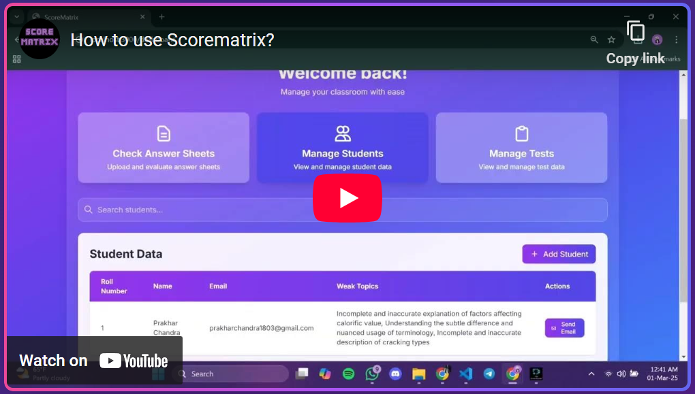
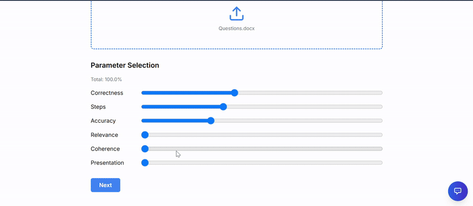
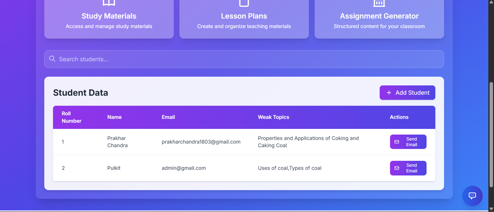
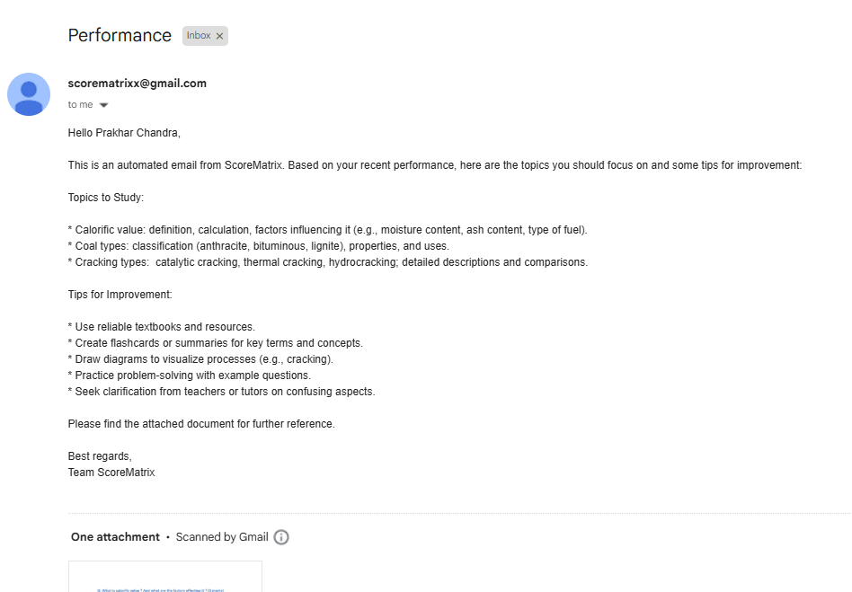
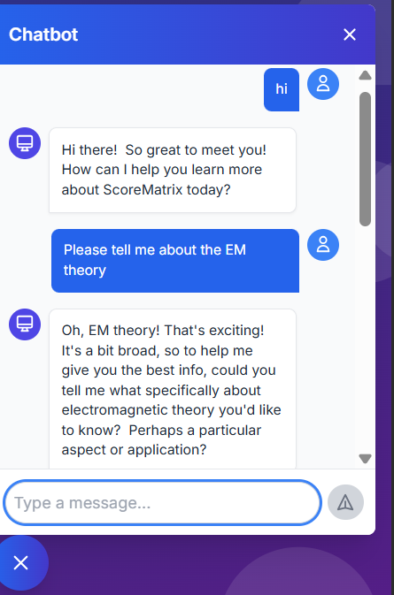

# ScoreMatrix – 
## *Streamline answer sheet evaluation with powerful AI precision*

A cloud-based platform that automates answer sheet evaluation using OCR, RAG-powered answer generation, custom rubrics, and deep performance insights – all from a single interface.

---

# Demo 

Take a quick look at ScoreMatrix in action! Watch how scanned answer sheets are uploaded, automatically evaluated, and analyzed with performance breakdowns.

[](https://youtu.be/NBsb-AdMObI)


---

# Core Features

---

## Automated Evaluation  
- Each sheet is processed in real-time, allowing for batch uploads and efficient grading workflows.


- High-accuracy OCR engine extracts answers from scanned handwritten sheets (even with slight noise or skew).


- Built with PyTesseract and OpenCV for preprocessing, enhanced with error-tolerant logic for poorly scanned images.

---

## Question Classification  
- Questions from uploaded PDFs/DOCX files are auto-categorized using NLP classifiers into:
  - Multiple Choice Questions (MCQs)  
  - Descriptive Questions  
  - Opinion-Based Questions  

- Ensures contextual understanding, not just keyword-based classification.
- Custom-trained transformer model with fallback rules for edge cases.

---

## RAG-Powered Answer Generation  
- Uses LangChain + Gemini for context-aware answer generation.
- Teachers upload a reference textbook, syllabus, or notes → ideal answers are generated in seconds.
- RAG (Retrieval-Augmented Generation) ensures content alignment with your source material.
  

---


## Custom Rubrics for Grading  
- Teachers define point allocation, required keywords, structure, tone, etc., per question.
- Rubrics are stored per test session, and reused as needed.
- Hybrid grading: ML-based + Rule-based scoring mechanisms.



---

## Scoring Justification  
- Each score includes a breakdown:

  - Keyword match score

  - Similarity to reference (and all other parameters choosen

  - Structural alignment (for essays)
- Students can be shown this breakdown optionally for transparency.


---

## Teacher-Focused Tools

---

### Dashboard for Analytics  
- Insights into student performance, weak areas, and overall class trends.  


---

### Personalized Feedback System  
- Automatically emails each student with targeted feedback based on their answer sheet.
- The email also includes the questions, correct answers, general improvement tips, and a list of topics to revise for better understanding


---

### Secure Admin Access  
- Secure login system powered by Firebase.
- Passwordless auth + Google OAuth supported.


---

## Mobile App
- Make pdfs and upload files with ease
- Smart AI features like Auto crop, auto set brightness

---

## Extras

---

### Plagiarism Detection  
- Compares answers across students and online sources using semantic similarity.
- Uses transformer embeddings to catch paraphrased cheating attempts.

--- 

### Answer Quality Grading (A.Q.G.)  
-Scores answers on:
  - Coherence
  - Depth
  - Language use
  - Structural clarity
- A.Q.G. score is separate from the actual score, but helps in holistic assessment.

---

### Smart Chatbot Assistant  
Built-in chatbot helps teachers or students query evaluation results, access rubrics, and get clarification on scoring instantly.  


---
# Techstack
---

## Frontend:

- Next.js (React-based framework for server-side rendering and routing)

- TailwindCSS for fast and responsive UI styling

- Axios for frontend-backend API communication via Next.js API routes

## Backend:

- Python  for handling OCR, evaluation, and AI workflows

- Tesseract OCR for extracting text from uploaded answer sheets

- LangChain + Gemini API for RAG-based answer generation

- Custom Machine Learning models for question classification and automated answer evaluation:(A multi-stage system combining multiple transformer models tailored for different tasks)
  - Answer relevance and correctness

  - Structural adherence (for essays)

  - Tone and coherence

  - Hybrid logic for edge cases

## Authentication:

- Firebase Auth with role-based access control (Admin, Teacher, Evaluator)

## Storage:

- Google Cloud Storage, with dynamic bucket creation

## Database:

- Firestore (NoSQL) — fast, scalable, and cloud-native

## Deployment:

- Google Cloud Run (fully serverless backend deployment)

- Cloud Build for automated CI/CD pipelines

## Mobile App:
- Kotlin (Android App)
- Jetpack Compose (UI)
- Android Auto (for machine learning model used in AI features)

## Other Tools & Libraries:

- Docker for containerization

- OpenCV, PyMuPDF, and ReportLab for image/PDF processing and report generation


---
# Installation
## Manual Setup:

1. Fork this repository. 

- Click the `Fork` button at the top-right corner of this repository page to create a copy of the repository under your GitHub account.

2. Clone the repository:
```bash
   git clone https://github.com/<your-username>/Score-Matrix.git
   ```

3. Change the working directory: 
```bash
   cd frontend
   ```

4. Install dependencies and required python modules:
```bash
   npm install
   pip install -r requirements.txt
   ```

5. Start the development server:
```bash
   npm run dev
   ```

You are all set! 
The app should now be running at [http://localhost:3000](http://localhost:3000).

---
## Docker:

1. Install Docker : First, make sure Docker is installed on your machine. You can follow the installation instructions based on your OS
2. Pull the Docker Image:
```bash
   docker pull phoenix1803/score-matrix
   ```
3. Run the Docker Container:
```bash
   docker run -d -p 3000:3000 phoenix1803/score-matrix
   ```
4. Verify the Running Container:
```bash
   docker ps
   ```
This will list all running containers, and you should see your Score-Matrix container listed with its respective ports.

You are all set! 
The app should now be running at [http://localhost:3000](http://localhost:3000).

---

# API Endpoints:

/upload-multiple: Uploads multiple answer sheets at once

/upload-reference: Uploads question paper

/uploadMaterial: Uploads any additional study materials

/chat: chatbot endpoint

/sendEmail: Sends emails (e.g., with feedback or reports)

/share-report: Generates share link

/students: Handles student-related data (like creating or updating student profiles on dashboard)

/convert-json-to-excel: converts the student.json into an xlxx file

/download: Downloading the app

/resetDefaults: Deletes uploads and makes everythin usable againg

---
# Flow:
1. Login:

- The user logs in (likely as a teacher or evaluator) by entering student details (scrolling down to the appropriate section).

- Action: Clicks to upload the sample question paper.

2. Upload the Question Paper:

- Action: Selects the sample question paper and clicks "next" after choosing evaluation parameters.

- Purpose: The question paper is uploaded and the system gets ready to evaluate answer sheets based on it.

3. Upload the Answer Sheet:

- Action: Uploads the scanned or digital answer sheet (in PDF or image format).

- Purpose: The system runs OCR (via Tesseract) on the answer sheet, classifies the questions, and prepares for evaluation.

4. System Evaluation:

- Action: The system runs through the answer sheet, classifies the answers, generates ideal answers using LangChain + Gemini, scores the answers, and generates feedback.

5. Result Generation:

- Action: Waits for the results to be processed and then downloads the evaluation report once it’s ready.

6. Return to Dashboard:

- Action: After downloading the report, the user can return to the main dashboard.

---

# Sample Data / Test Flow:
To help with testing, here’s how you can set up sample data and test the flow:

## Sample Files:
(download these files)

- sample/sample-answersheet.pdf

- sample/sample-question-paper.pdf

## Test Flow:

1. Upload the sample answer sheet or a bulk PDF (if there are multiple students).

2. The system:
   
   a) Runs OCR via Tesseract to extract text from the images/PDF.

   b) Classifies the questions based on the question set.

   c) Generates ideal answers using LangChain and Gemini API.

   d) Scores the answers and generates detailed feedback.

4. Teachers can view results in a dashboard, export reports, and see breakdowns of the evaluation.

---

# Security & Privacy
- Data Encryption: All file uploads encrypted using AES-256 on the backend

- Firebase Auth: Role-based access for Teachers, Admins, Evaluators

- Cloud Storage: Isolated buckets for each institution

- Audit Logs: Login, evaluation, and feedback actions logged for admin review

# Deployment
- Live Demo Access:
[Hosted on Google Cloud Run](https://scorematrixx-377627906357.asia-south2.run.app/)
---

# Future Improvements
ScoreMatrix is designed to scale across institutions with minimal overhead. Planned enhancements include:

1. Faster Data Pipelines
Real-time streaming OCR and upload pipelines with GZIP + WebSocket based previews.

2. Advanced Cloud Storage
Switch to Google Cloud Storage with intelligent lifecycle policies.

3. Offline Support
Local server deployment mode for schools in low-connectivity regions. Sync when reconnected.

4. Modular Microservices
Evaluation, feedback, and analytics split into containerized services for institutional plug-and-play.

5. Federated AI Evaluation
Enable on-device evaluation using federated models — low compute, zero internet dependency.

---

